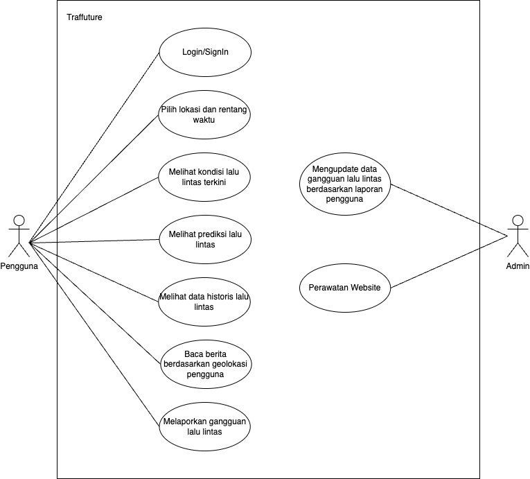
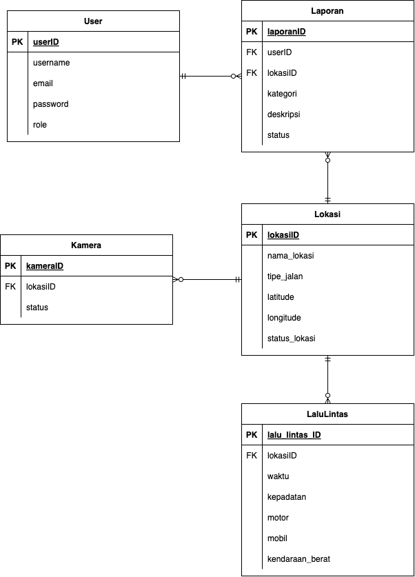
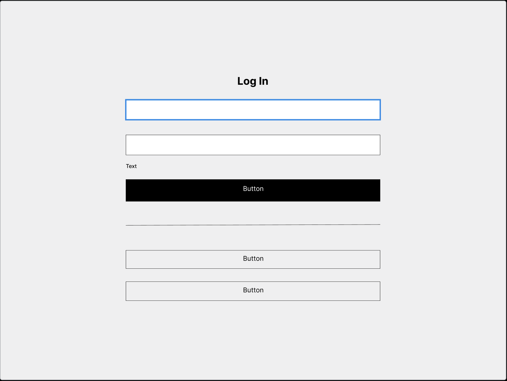
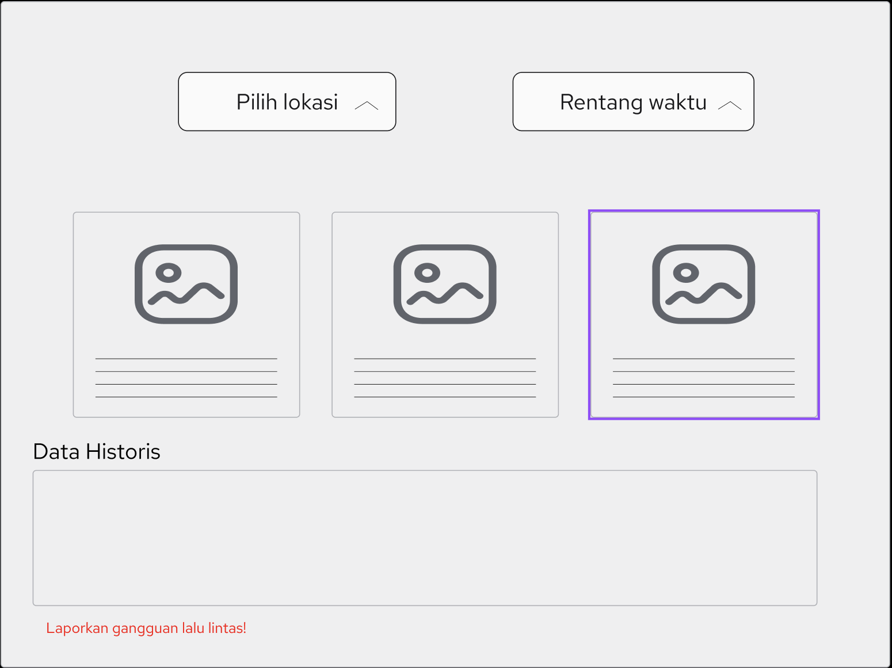
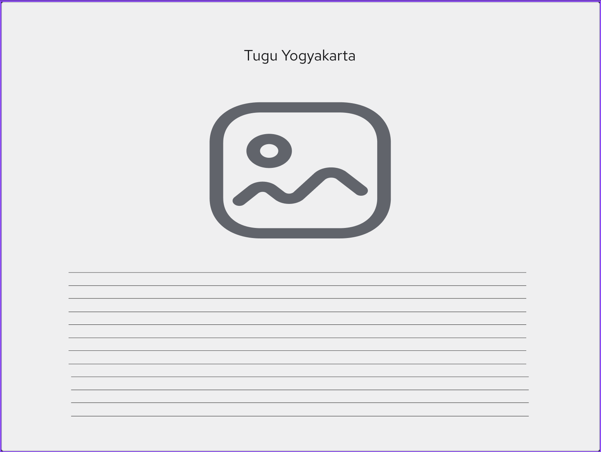
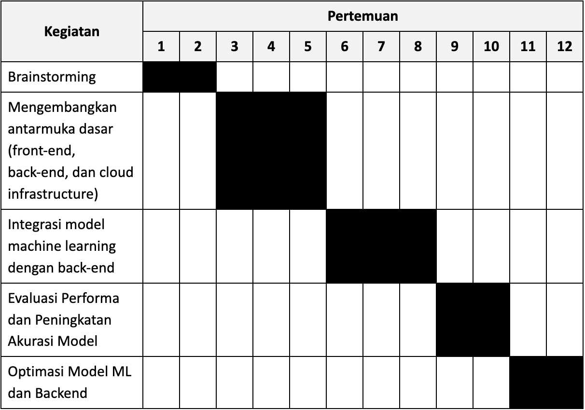

# Kelompok 15 (Traffuture)

| Nama | NIM | Peran |
| ---- | --- | ----- |
| Sean Titan Yang | `22/492933/TK/53965` |Software Engineer (SE) |
| Athaya Harmana Putri | `22/492673/TK/53930` | AI Engineer (AIE) & Cloud Engineer (CE) |

### Project Senior Project TI

#### Departemen Teknologi Elektro dan Teknologi Informasi, Fakultas Teknik, Universitas Gadjah Mada

# Traffuture

## Latar Belakang

Kemacetan lalu lintas merupakan salah satu tantangan utama di kota-kota besar yang
berdampak pada berbagai aspek kehidupan, seperti keterlambatan perjalanan,
peningkatan konsumsi bahan bakar, serta penurunan produktivitas masyarakat. Untuk 
mengatasi permasalahan ini, diperlukan pemantauan dan analisis lalu lintas yang akurat
agar dapat memahami pola kepadatan kendaraan. Saat ini, banyak data lalu lintas telah
terdokumentasi dalam bentuk data tabel yang mencatat jumlah kendaraan berdasarkan
waktu, lokasi, dan kondisi lalu lintas. Namun, pemanfaatan data ini sering kali belum
maksimal karena masih tersimpan dalam bentuk yang sulit dianalisis secara langsung oleh
pengguna umum. Oleh karena itu, dibutuhkan sebuah aplikasi berbasis data analitik yang
memungkinkan pengguna untuk menginput rentang waktu tertentu dan mendapatkan
informasi mengenai jumlah kendaraan serta jenis kemacetan berdasarkan data historis
yang tersedia.

## Rumusan Permasalahan

1. Bagaimana cara mengetahui tingkat kemacetan suatu lokasi tertentu di jam
tertentu?
2. Bagaimana menyajikan hasil analisis lalu lintas secara informatif dan mudah
dipahami oleh pengguna?

## Ide Solusi

Pengembangan aplikasi untuk mendeteksi tingkat kemacetan di titik titik tertentu
berdasarkan data historis jumlah kendaraan di titik tersebut

## Rancangan Fitur

| No. | Fitur | Keterangan |
| --- | ----- | ---------- |
|1| Deteksi Kemacetan Real-Time | Menampilkan kondisi lalu lintas secara langsung |
|2| Prediksi Kemacetan Masa Depan | Menggunakan kecerdasan buatan (AI) untuk menganalisis data historis lalu lintas serta pola perjalanan |
|3| Histori Lalu Lintas | Menyediakan data mengenai pola kemacetan berdasarkan waktu dan lokasi tertentu |
|4| Preferensi Lokasi & Waktu | Memungkinkan pengguna mengetahui kondisi kemacetan denganmenentukan area tertentu serta waktu tertentu |

## Analisis Kompetitor

1. KOMPETITOR 1
   
   | Keypoint | Value |
   | --- | --- |
   | Nama | Google Maps |
   | Jenis Kompetitor | Direct Competitors |
   | Jenis Produk | Aplikasi navigasi dengan fitur pemantauan lalu lintas real-time. |
   | Target Customer | Pengguna kendaraan pribadi, pengemudi transportasi online, dan pejalan kaki |
   | Kelebihan | Menyediakan informasi lalu lintas realtime. Menyediakan informasi lalu lintas realtime. Terintegrasi dengan berbagai layanan(transportasi online, bisnis lokal, dll.). Memiliki fitur navigasi suara dan rekomendasi rute alternatif. Dukungan global dengan cakupan wilayah yang luas. Data akurat berkat kontribusi pengguna dan sensor lalu lintas |
   | Kekurangan | Prediksi kemacetan untuk waktu mendatang masih terbatas. Membutuhkan koneksi internet yang stabil untuk data real-time. Kurang akurat dalam beberapa area dengan infrastruktur jalan yang kurang terdokumentasi |
   | Key Competitive Advantage & Unique Value | Google Maps unggul dalam cakupan global dan integrasi ekosistem Google, menjadikannya alat navigasi yang kuat dengan data lalu lintas yang luas dan akurat |
2. KOMPETITOR 2
   
   | Keypoint | Value |
   | --- | --- |
   | Nama | Jasa Marga Integrated Traffic Information System (JMITIS) |
   | Jenis Kompetitor | Indirect competitor karena hanya fokus pada jalan tol |
   | Jenis Produk | Sistem pemantauan lalu lintas jalan tol |
   | Target Customer | Pengendara tol unttuk kendaraan roda 4 atau lebih |
   | Kelebihan | Data pada lalu lintas tol lebih spesifik dan akurat. Terintegrasi dengan sistem pembayaran tol dan pengelolaan jalan |
   | Kekurangan | Hanya mencakup jalan tol saja. Tidak memiliki fitur untuk input rentang waktu dalam melakukan analisis kepadatan lalu lintas |
   | Key Competitive Advantage & Unique Value | Data yang digunakan terpercaya karena pengembang aplikasi merupakan pengelola jalan tol juga |
3. KOMPETITOR 3
   
   | Keypoint | Value |
   | --- | --- |
   | Nama | Moovit |
   | Jenis Kompetitor | Indirect Competitors |
   | Jenis Produk | Aplikasi navigasi transportasi publik dengan informasi lalu lintas |
   | Target Customer | Pengguna transportasi umum seperti bus, KRL, MRT, dan angkot |
   | Kelebihan | Menyediakan rute transportasi umum secara detail, termasuk jadwal keberangkatan dan kedatangan. Memberikan informasi tentang keterlambatan atau gangguan layanan transportasi umum. Bisa digunakan di banyak kota di seluruh dunia |
   | Kekurangan | Tidak berfokus pada pengguna dengan kendaraan pribadi. Tidak memiliki prediksi akan kendala yang akan terjadi. Data kadang kurang akurat karena hanya bergantung pada operator |
   | Key Competitive Advantage & Unique Value | Fokus pada Transportasi Publik. Data Real-Time dari Komunitas. Cakupan Global di Banyak Kota-kota di berbagai negara |

## Metodologi SDLC: Agile Scrum

Metodologi Agile Scrum dipakai karena cocok jika proyek dikerjakan dalam tim dan ada banyak iterasi/perubahan, pembagian kerja dalam sprint pendek sehingga memiliki fleksibilitas dalam perubahan fitur, dan cocok untuk eksplorasi dan eksperimen dengan model machine learning.

## Perancangan Tahap 1-3 SDLC

### Tujuan dari Produk

1. Memudahkan pengguna dalam memprediksi lokasi berdasarkan waktu dan tempat yang dipilih.
2. Meningkatkan efisiensi perencanaan perjalanan atau aktivitas berdasarkan pola prediksi.
3. Memberikan visualisasi data yang mudah dipahami oleh pengguna untuk mendukung pengambilan keputusan.

### Pengguna Potensial dari Produk dan Kebutuhan Para Pengguna Tersebut 

1. Akademisi/Peneliti 
   -   Model machine learning yang dapat diuji dan dibandingkan.
   -   API atau fitur ekspor data untuk analisis lebih lanjut.
2. Pemerintah
   -   Prediksi kepadatan suatu lokasi pada waktu tertentu untuk manajemen lalu lintas atau kebijakan publik.
   -   Visualisasi tren pergerakan untuk perencanaan infrastruktur.
   -   Integrasi dengan sistem pemantauan kota lainnya.
3. Masyarakat Umum
   -   Antarmuka yang intuitif dan mudah digunakan.
   -   Prediksi lokasi yang akurat untuk membantu perencanaan perjalanan.
   -   Kemampuan menyimpan atau berbagi hasil prediksi.
4. Developer
   -   Dokumentasi API yang jelas untuk pengembangan lanjutan.
   -   Sistem log error/debugging untuk meningkatkan performa.

### Use Case Diagram

### Functional Requirements untuk Use Case yang Telah Dirancang

| FR | Deskripsi |
| --- | --- |
| Autentikasi Pengguna | Sistem harus memungkinkan pengguna untuk Login/Sign In menggunakan akun terdaftar. Sistem harus menampilkan pesan error jika pengguna memasukkan kredensial yang salah. Sistem harus mendukung fitur logout untuk mengakhiri sesi pengguna. |
| Pemilihan Lokasi dan Waktu | Pengguna dapat memilih lokasi dan rentang waktu untuk melihat data lalu lintas terkini maupun data lalu lintas prediksi. Sistem harus menampilkan daftar lokasi yang tersedia. Sistem harus memungkinkan pengguna untuk mengatur rentang waktu. |
| Informasi Lalu Lintas | Pengguna dapat melihat kondisi lalu lintas terkini berdasarkan lokasi yang dipilih. Sistem harus menampilkan informasi secara real-time. Pengguna dapat melihat prediksi lalu lintas berdasarkan data historis dan model machine learning. Sistem harus menampilkan data historis lalu lintas untuk periode tertentu. |
| Berita lalu Lintas | Pengguna dapat membaca berita lalu lintas berdasarkan geolokasi mereka. Sistem harus mengambil berita dari sumber terpercaya dan menampilkan berita terbaru. |
| Pelaporan Gangguan Lalu Lintas | Pengguna dapat melaporkan gangguan lalu lintas, seperti kecelakaan atau jalan rusak. Laporan harus mencakup lokasi, jenis gangguan, dan waktu kejadian. |
| Manajemen Data oleh Admin | Admin dapat mengupdate data gangguan lalu lintas berdasarkan laporan pengguna. Admin dapat menghapus atau memperbarui laporan gangguan jika diperlukan. Sistem harus mendukung perawatan website, termasuk pembaruan konten dan pemeliharaan sistem.|

### Entity Relationship Diagram

### Low-fidelity Wireframe

1. Halaman Login
   
2. Halaman Dashboard
   
3. Halaman Lalu Lintas
   

### Gantt-Chart Pengerjaan Proyek dalam Kurun Waktu Satu Semester

